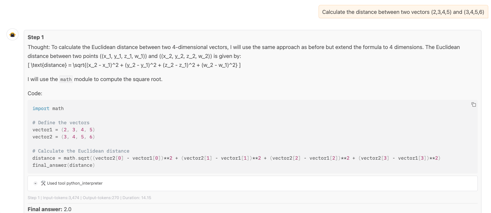

# Chatbot RAG

> A chatbot designed to autonomously crawl websites and utilize a Retrieval-Augmented Generation (RAG) system to answer user queries. The chatbot dynamically extracts content from specified websites, processes the information, and leverages the RAG framework to generate accurate and contextually relevant responses. This system is aimed at enhancing user interaction by providing instant, precise, and knowledge-based answers sourced directly from the web.

<table>
  <tr>
    <td>
      
    </td>
  </tr>
</table>

## 👨‍💻 Contributors:
-  Tuan (Alan) Le tuanlattnlhp@gmail.com

## 💾 Technologies

- **Frontend**: Streamlit
- **Backend**: Python
- **LLM Framework**: Langchain, Hugging Face 
- **Vector Database**: ChromaDB

## 🌟 Features

- Leverages the cutting-edge GPT-2 language model from the Hugging Face library to generate accurate and contextually relevant answers.

- Utilize the Langchain Web Loader to seamlessly crawl and extract content from any website.
  
- Chunks documents into manageable pieces, and store in ChromaDB

## Run
`git push --set-upstream origin main`
